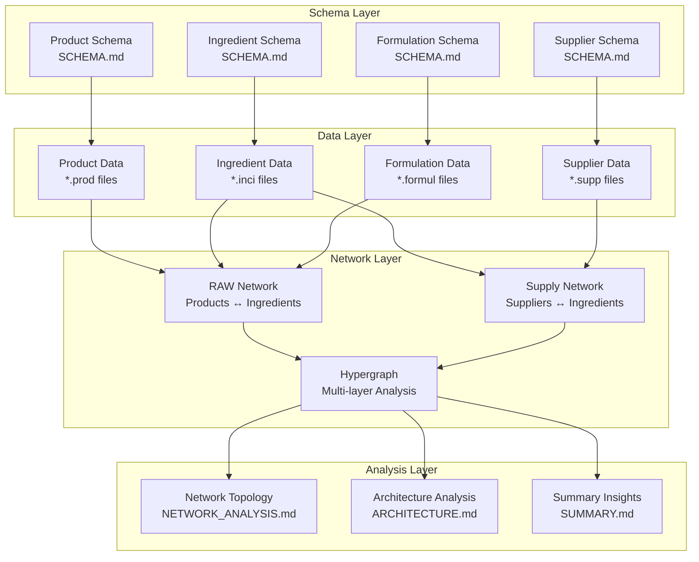
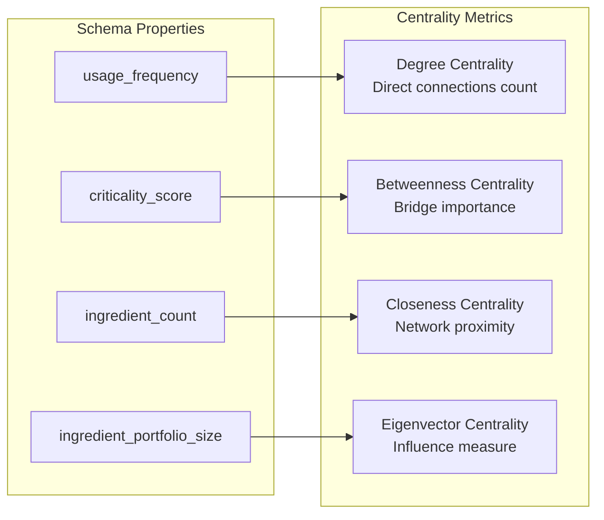

# Hypergraph Integration Documentation

## Overview

This document describes how the SKIN-TWIN data schemas integrate with the hypergraph analysis framework documented in the [examples](./examples/) directory. The schemas provide the structured data foundation that enables comprehensive network analysis and insights generation.

## Hypergraph Architecture Integration

### Multi-Layer Network Structure



## Data Flow and Relationships

### Network Construction from Schema Data

```typescript
interface NetworkConstruction {
  // Raw Material Network (Formulation Layer)
  raw_network: {
    nodes: (Product | Ingredient)[];
    edges: FormulationEdge[];
    properties: {
      bipartite: true;
      weighted: true;
      directed: true;
    };
  };
  
  // Supply Chain Network (Logistics Layer)
  supply_network: {
    nodes: (Supplier | Ingredient)[];
    edges: SupplyEdge[];
    properties: {
      bipartite: true;
      weighted: true;
      directed: true;
    };
  };
  
  // Combined Hypergraph
  hypergraph: {
    layers: ['supply', 'ingredient', 'formulation', 'product'];
    cross_layer_edges: IngredientBridge[];
    metrics: NetworkMetrics;
  };
}
```

### Key Network Metrics Calculation

#### Node Centrality Measures



## Schema-to-Network Mapping

### Product Network Properties

```typescript
interface ProductNetworkNode extends Product {
  // Network-specific properties
  network_properties: {
    degree: number;                    // = ingredient_count
    complexity_weight: number;         // = complexity_score / 100
    category_cluster: ProductCategory; // Clustering attribute
    centrality_scores: {
      degree: number;
      betweenness: number;
      eigenvector: number;
    };
  };
}
```

### Ingredient Network Properties

```typescript
interface IngredientNetworkNode extends Ingredient {
  // Network-specific properties
  network_properties: {
    usage_degree: number;              // = usage_frequency
    supply_degree: number;             // Connected suppliers count
    bridge_importance: number;         // Cross-layer connectivity
    risk_score: number;                // Supply chain vulnerability
    centrality_scores: {
      degree: number;
      betweenness: number;
      eigenvector: number;
    };
  };
}
```

### Edge Weight Calculations

#### Formulation Edges

```typescript
interface FormulationEdgeWeights {
  primary_weight: number;        // = concentration / 100
  stability_weight: number;      // = stability_impact / 10
  criticality_weight: number;    // Based on ingredient criticality
  combined_weight: number;       // Weighted combination
}

function calculateFormulationWeight(edge: FormulationEdge, ingredient: Ingredient): number {
  const concentration_weight = edge.concentration / 100;
  const stability_weight = edge.stability_impact / 10;
  const criticality_weight = ingredient.criticality_score / 100;
  
  return (concentration_weight * 0.6) + 
         (stability_weight * 0.2) + 
         (criticality_weight * 0.2);
}
```

#### Supply Chain Edges

```typescript
interface SupplyEdgeWeights {
  volume_weight: number;         // Based on supplier portfolio size
  reliability_weight: number;    // Based on reliability score
  risk_weight: number;          // Inverse of diversification
  combined_weight: number;       // Risk-adjusted supply strength
}

function calculateSupplyWeight(edge: SupplyEdge, supplier: Supplier): number {
  const volume_weight = supplier.ingredient_portfolio_size / 16; // Max portfolio
  const reliability_weight = supplier.reliability_score / 100;
  const risk_weight = 1 / (supplier.backup_suppliers_ratio || 1);
  
  return (volume_weight * 0.4) + 
         (reliability_weight * 0.4) + 
         (risk_weight * 0.2);
}
```

## Analysis Integration Points

### Community Detection Mapping

```typescript
interface CommunityMapping {
  functional_communities: {
    water_phase: string[];      // Products using R010000 heavily
    oil_phase: string[];        // Products with high lipid content
    active_systems: string[];   // Products with high active %
    preservation: string[];     // Products with advanced preservation
  };
  
  supplier_communities: {
    diversified: string[];      // NAT0001, MEG0001 type
    specialized: string[];      // Single-focus suppliers
    regional: string[];         // Geographic clustering
  };
  
  risk_communities: {
    high_risk: string[];        // Single-sourced critical ingredients
    medium_risk: string[];      // Limited supplier diversity
    low_risk: string[];         // Well-diversified supply
  };
}
```

### Vulnerability Analysis

```typescript
interface VulnerabilityMetrics {
  supply_chain_risks: {
    single_source_ingredients: number;    // Count of R-series with 1 supplier
    critical_supplier_dependencies: number; // High-volume single suppliers
    geographic_concentration: number;      // Regional risk concentration
  };
  
  formulation_risks: {
    high_concentration_dependencies: number; // >10% concentration ingredients
    specialized_active_risks: number;       // Hard-to-replace actives
    stability_system_risks: number;         // Critical stabilizer dependencies
  };
  
  network_resilience: {
    alternative_pathways: number;           // Redundant formulation routes
    supplier_backup_coverage: number;      // % ingredients with backups
    substitution_flexibility: number;      // Alternative ingredient availability
  };
}
```

## Query Patterns and Analysis

### Network Analysis Queries

```sql
-- Find critical ingredients (high betweenness centrality)
SELECT i.label, i.usage_frequency, i.criticality_score
FROM ingredients i
WHERE i.network_properties.betweenness_centrality > 0.5
ORDER BY i.criticality_score DESC;

-- Identify supply chain vulnerabilities
SELECT i.label, COUNT(s.supplier_id) as supplier_count
FROM ingredients i
LEFT JOIN supply_edges s ON i.id = s.ingredient_id
GROUP BY i.id
HAVING supplier_count = 1 AND i.usage_frequency > 10;

-- Find product complexity clusters
SELECT 
  CASE 
    WHEN p.complexity_score < 50 THEN 'Simple'
    WHEN p.complexity_score < 80 THEN 'Moderate'
    ELSE 'Complex'
  END as complexity_tier,
  COUNT(*) as product_count,
  AVG(p.ingredient_count) as avg_ingredients
FROM products p
GROUP BY complexity_tier;
```

### Cross-Layer Analysis

```typescript
interface CrossLayerMetrics {
  ingredient_bridge_analysis: {
    cross_layer_nodes: string[];        // Ingredients in both networks
    bridge_importance: number[];        // Connectivity significance
    vulnerability_impact: number[];    // Risk if bridge fails
  };
  
  end_to_end_paths: {
    supplier_to_product: PathAnalysis[]; // Complete supply chain paths
    critical_dependencies: string[];    // Essential pathway components
    alternative_routes: number;         // Redundancy measures
  };
}
```

## Integration with Existing Analysis

### Alignment with Documentation

The schema implementation directly supports the analysis documented in:

- **[README.md](./examples/README.md)**: Provides comprehensive network analysis based on these schemas
- **[ARCHITECTURE.md](./examples/ARCHITECTURE.md)**: Technical implementation leveraging these data structures  
- **[NETWORK_ANALYSIS.md](./examples/NETWORK_ANALYSIS.md)**: Advanced topology analysis using schema-derived networks
- **[SUMMARY.md](./examples/SUMMARY.md)**: Executive insights generated from schema-based analysis

### Data Validation and Consistency

```typescript
interface ValidationRules {
  referential_integrity: {
    formulation_edges: "source_id must exist in ingredients, target_id in products";
    supply_edges: "ingredient_id must exist in ingredients, supplier_id in suppliers";
  };
  
  network_consistency: {
    usage_frequency: "Must match actual edge count in formulation network";
    supplier_portfolio: "Must match actual supply edge count";
    complexity_score: "Must correlate with actual ingredient count";
  };
  
  business_logic: {
    concentration_limits: "Sum per product ≤ 100%";
    supply_coverage: "All ingredients must have ≥1 active supplier";
    safety_compliance: "All ingredients must have valid safety_rating";
  };
}
```

## Future Enhancements

### Dynamic Network Updates

- Real-time schema validation during data updates
- Incremental network metric recalculation
- Change impact analysis for formulation modifications
- Supply chain disruption simulation

### Advanced Analytics Integration

- Machine learning model training on schema-structured data
- Predictive analytics for supply chain optimization
- Automated formulation recommendation based on network insights
- Risk assessment automation using network topology

## Usage Guidelines

1. **Data Entry**: Use schema-compliant data structures for all new entries
2. **Validation**: Run consistency checks before network analysis
3. **Updates**: Propagate changes through all dependent network calculations
4. **Analysis**: Leverage existing analysis patterns documented in examples/
5. **Reporting**: Use schema properties to enhance network visualizations