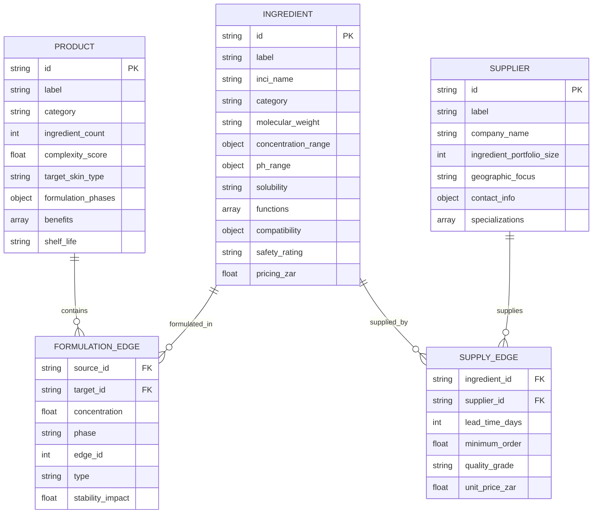

# SKIN-TWIN Data Schema Documentation

## Overview

This document defines the comprehensive data schemas for the SKIN-TWIN platform's formulation, ingredient, product, and supplier management systems. These schemas support the hypergraph architecture detailed in the [examples documentation](./examples/).

## Schema Architecture



## Core Data Types

### Product Schema

```typescript
interface Product {
  // Identification
  id: string;                    // Format: B19[PRODUCT_CODE] (e.g., "B19PRDSPAMRM000")
  label: string;                 // Human-readable product name
  category: ProductCategory;     // Product classification
  
  // Formulation Properties
  ingredient_count: number;      // Total number of ingredients
  complexity_score: number;     // Calculated complexity metric (0-100)
  target_skin_type: SkinType[];  // Target skin conditions/types
  
  // Formulation Structure
  formulation_phases: {
    phase_a_water?: PhaseDefinition;
    phase_b_oil?: PhaseDefinition;
    phase_c_active?: PhaseDefinition;
    phase_d_preservation?: PhaseDefinition;
    phase_e_adjustment?: PhaseDefinition;
  };
  
  // Product Information
  benefits: string[];            // Key skincare benefits
  instructions: string[];        // Manufacturing/application instructions
  shelf_life: string;           // Expected shelf life
  testing_required: TestType[]; // Required safety/stability tests
  
  // Metadata
  created_date: string;         // ISO 8601 timestamp
  last_modified: string;        // ISO 8601 timestamp
  version: string;              // Formulation version
}

type ProductCategory = 
  | "Treatment Serum" 
  | "Masque" 
  | "Facial Oil" 
  | "Sun Protection" 
  | "Night Complex" 
  | "Cleanser" 
  | "Resurfacer";

type SkinType = 
  | "All skin types" 
  | "Sensitive" 
  | "Dry" 
  | "Oily" 
  | "Combination" 
  | "Mature" 
  | "Acne-prone";

interface PhaseDefinition {
  ingredients: { [ingredientId: string]: number }; // concentration %
  temperature?: number;         // Processing temperature °C
  mixing_time?: number;         // Minutes
  special_instructions?: string;
}

type TestType = "Stability" | "Microbial" | "Patch test" | "pH" | "Viscosity";
```

### Ingredient Schema

```typescript
interface Ingredient {
  // Identification
  id: string;                   // Format: R[CATEGORY][NUMBER] (e.g., "R010000")
  label: string;                // Common ingredient name
  inci_name: string;           // INCI (International) name
  category: IngredientCategory; // Functional classification
  
  // Chemical Properties
  molecular_weight?: string;    // Molecular weight range
  concentration_range: {
    min: number;               // Minimum safe concentration %
    max: number;               // Maximum safe concentration %
    typical: number;           // Typical usage concentration %
  };
  ph_range?: {
    min: number;               // Minimum stable pH
    max: number;               // Maximum stable pH
    optimal: number;           // Optimal pH
  };
  solubility: SolubilityType;  // Solubility characteristics
  
  // Functional Properties
  functions: FunctionType[];    // Primary functions in formulation
  compatibility: {
    synergistic: string[];     // Compatible ingredients
    avoid: string[];           // Incompatible ingredients
    neutral: string[];         // Neutral interactions
  };
  
  // Safety & Regulatory
  safety_rating: SafetyRating; // Safety classification
  restrictions?: string[];     // Usage restrictions
  allergen_info?: string;      // Allergen information
  
  // Commercial
  pricing_zar: number;         // Price per 100g in ZAR
  supplier_ids: string[];      // Available suppliers
  
  // Usage Statistics
  usage_frequency: number;     // Number of products using this ingredient
  criticality_score: number;  // Network criticality score (0-100)
}

type IngredientCategory = 
  | "Base/Carrier" 
  | "Active Compound" 
  | "Emulsifier" 
  | "Preservative" 
  | "Stabilizer" 
  | "pH Adjuster" 
  | "Fragrance" 
  | "Colorant";

type SolubilityType = 
  | "Water soluble" 
  | "Oil soluble" 
  | "Alcohol soluble" 
  | "Partially soluble" 
  | "Insoluble";

type FunctionType = 
  | "Humectant" 
  | "Emollient" 
  | "Antioxidant" 
  | "UV Filter" 
  | "Anti-aging" 
  | "Brightening" 
  | "Antimicrobial" 
  | "Thickener" 
  | "Film former";

type SafetyRating = 
  | "GRAS"           // Generally Recognized As Safe
  | "COSMETICALLY_SAFE" 
  | "RESTRICTED" 
  | "REQUIRES_TESTING";
```

### Supplier Schema

```typescript
interface Supplier {
  // Identification
  id: string;                   // Format: [CODE][NUMBER] (e.g., "NAT0001")
  label: string;                // Short supplier name
  company_name: string;         // Full legal company name
  
  // Business Information
  ingredient_portfolio_size: number; // Number of ingredients supplied
  geographic_focus: string[];   // Primary markets served
  specializations: SupplierSpecialization[]; // Areas of expertise
  
  // Contact Information
  contact_info: {
    address?: string;
    phone?: string;
    email?: string;
    website?: string;
    primary_contact?: string;
  };
  
  // Commercial Terms
  payment_terms?: string;       // Payment conditions
  minimum_order_value?: number; // Minimum order in ZAR
  lead_time_standard?: number;  // Standard lead time in days
  
  // Quality & Certifications
  certifications: string[];     // Quality certifications
  quality_grade_standards: string[]; // Grade standards offered
  
  // Relationship Metrics
  market_share: number;         // % of total ingredient supply
  reliability_score: number;   // Supplier reliability (0-100)
  partnership_level: PartnershipLevel;
}

type SupplierSpecialization = 
  | "Active Compounds" 
  | "Natural Extracts" 
  | "Preservative Systems" 
  | "Emulsification" 
  | "Specialized Actives" 
  | "Bulk Ingredients";

type PartnershipLevel = 
  | "Strategic Partner" 
  | "Preferred Supplier" 
  | "Standard Supplier" 
  | "Occasional Supplier";
```

### Edge Schemas

```typescript
interface FormulationEdge {
  // Relationship Definition
  source_id: string;            // Ingredient ID
  target_id: string;            // Product ID
  type: "Directed";             // Always directed from ingredient to product
  id: number;                   // Unique edge identifier
  
  // Formulation Details
  concentration: number;        // Ingredient concentration in product (%)
  phase: FormulationPhase;      // Which formulation phase
  stability_impact: number;    // Impact on formulation stability (0-10)
  
  // Processing Information
  addition_order?: number;      // Order of addition in manufacturing
  temperature_requirement?: number; // Processing temperature °C
  mixing_duration?: number;     // Required mixing time minutes
  
  // Quality Control
  tolerance: {
    lower: number;              // Lower concentration tolerance %
    upper: number;              // Upper concentration tolerance %
  };
  
  // Metadata
  validated_date?: string;      // Last validation date
  formulator_notes?: string;    // Formulation notes
}

type FormulationPhase = 
  | "aqueous" 
  | "oil" 
  | "active" 
  | "preservation" 
  | "adjustment";

interface SupplyEdge {
  // Relationship Definition
  ingredient_id: string;        // Ingredient ID
  supplier_id: string;         // Supplier ID
  type: "Directed";            // Always directed from ingredient to supplier
  
  // Commercial Terms
  unit_price_zar: number;      // Price per unit in ZAR
  minimum_order: number;       // Minimum order quantity
  lead_time_days: number;      // Standard lead time
  
  // Quality Specifications
  quality_grade: string;       // Grade specification
  purity_level?: string;       // Purity requirements
  shelf_life_months?: number;  // Ingredient shelf life
  
  // Logistics
  packaging_options: string[]; // Available packaging
  storage_requirements?: string; // Special storage needs
  shipping_restrictions?: string[]; // Shipping limitations
  
  // Relationship Status
  contract_status: ContractStatus;
  last_order_date?: string;    // Last order placed
  total_volume_ytd?: number;   // Year-to-date volume
}

type ContractStatus = 
  | "Active Contract" 
  | "Spot Purchase" 
  | "Under Negotiation" 
  | "Suspended";
```

## Validation Rules

### Product Validation
- `id` must follow pattern: `B19[A-Z0-9]+`
- `ingredient_count` must match actual formulation edges
- Total concentration per phase should not exceed 100%
- At least one benefit must be specified
- `complexity_score` calculated as: `(ingredient_count * 2) + (unique_categories * 5)`

### Ingredient Validation
- `id` must follow pattern: `R[0-9]{6}`
- `concentration_range.max` must be ≤ 200% (for pure ingredients)
- `concentration_range.min` must be ≥ 0.001%
- `safety_rating` required for all ingredients
- `usage_frequency` must match actual usage in formulations

### Formulation Edge Validation
- `concentration` must be within ingredient's safe range
- Sum of concentrations per product should be ≤ 100%
- `source_id` must exist in ingredients collection
- `target_id` must exist in products collection

### Supply Edge Validation
- Each ingredient should have at least one active supplier
- `lead_time_days` must be > 0
- `unit_price_zar` must be > 0
- `quality_grade` must be specified

## File Naming Conventions

### Directory Structure
```
vessels/
├── formulations/           # Product formulation examples
│   ├── *.formul          # Individual formulation files
├── ingredients/           # Ingredient specifications
│   ├── *.inci            # Individual ingredient files
├── products/             # Product definitions
│   ├── *.prod            # Individual product files
├── suppliers/            # Supplier information
│   ├── *.supp            # Individual supplier files
├── examples/             # Analysis and documentation
└── SCHEMA.md             # This file
```

### File Naming
- **Formulations**: `{product_name_snake_case}.formul`
- **Ingredients**: `{ingredient_name_snake_case}.inci`
- **Products**: `{product_name_snake_case}.prod`
- **Suppliers**: `{supplier_name_snake_case}.supp`

## Integration with Hypergraph Analysis

This schema directly supports the hypergraph analysis documented in [vessels/examples/](./examples/):

- **Network Nodes**: Products, Ingredients, Suppliers
- **Network Edges**: Formulation relationships, Supply relationships
- **Metrics**: Centrality, clustering, vulnerability analysis
- **Topology**: Multi-layer hypergraph with cross-layer connectivity

See [ARCHITECTURE.md](./examples/ARCHITECTURE.md) for detailed technical implementation and [README.md](./examples/README.md) for comprehensive network analysis.