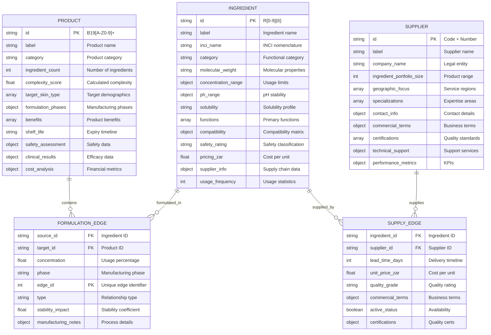
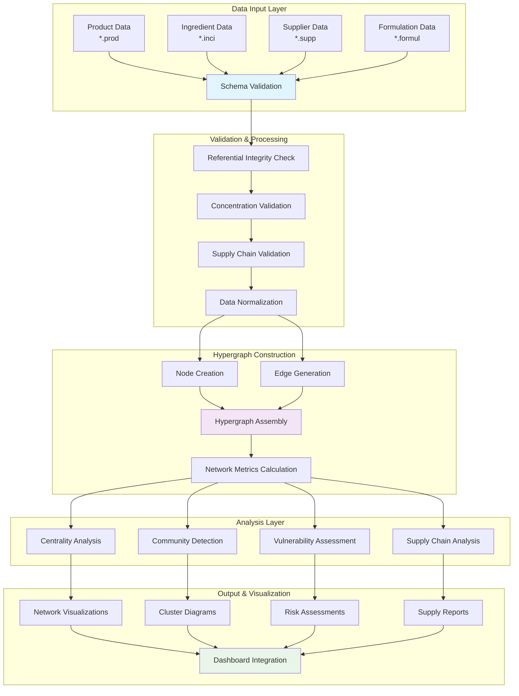
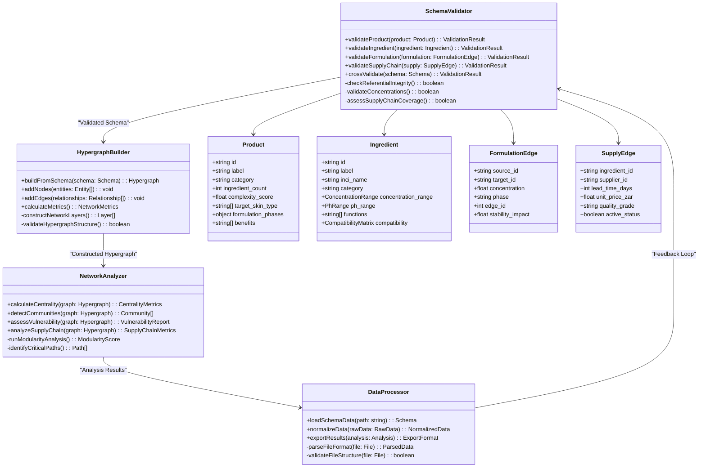
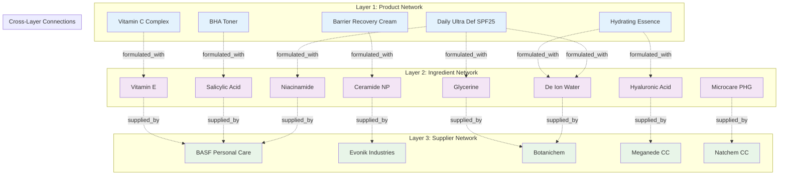
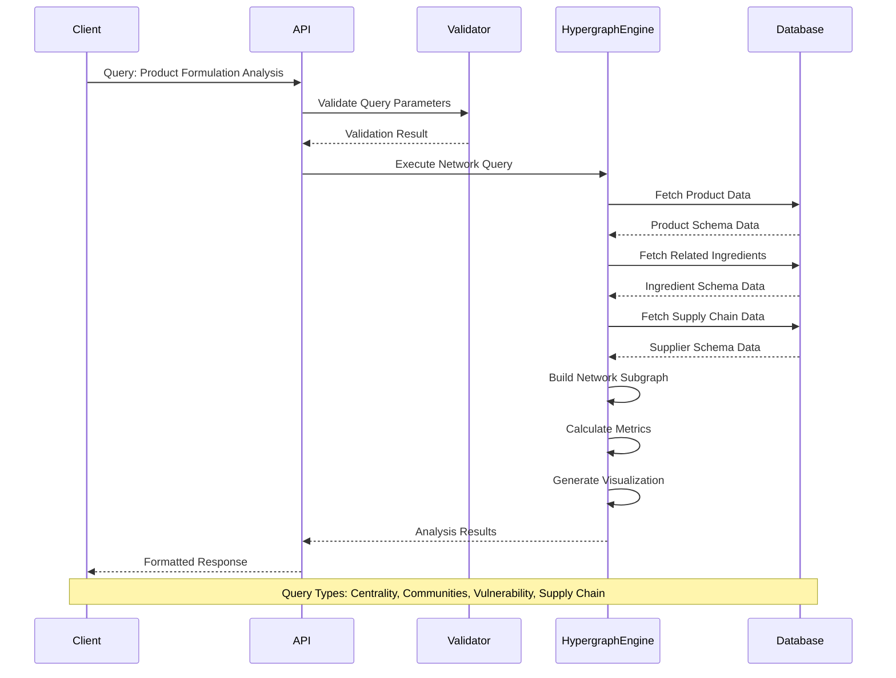
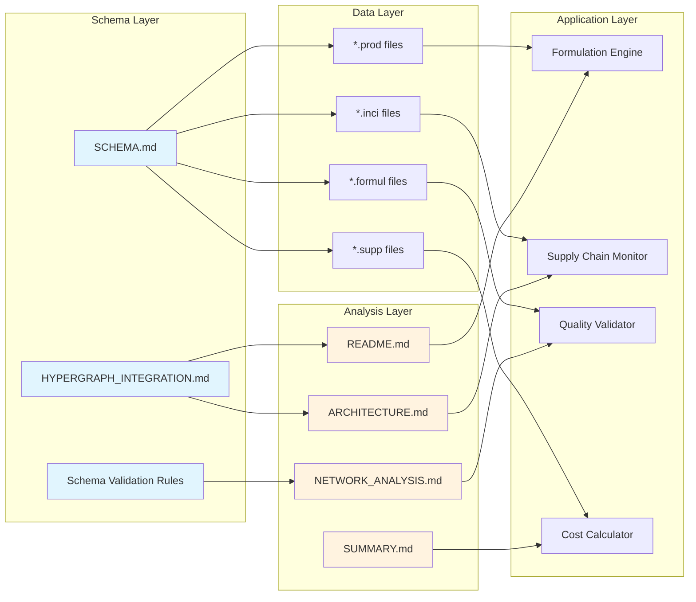

# SKIN-TWIN Schema Visualization Documentation

## Overview

This document provides comprehensive visual representations of the SKIN-TWIN data schemas, showing relationships, data flows, and technical architecture through detailed mermaid diagrams.

## Entity Relationship Architecture

### Core Schema Relationships



## Data Flow Architecture

### Hypergraph Data Processing Pipeline



## Schema Validation Architecture

### Validation Rules & Constraints

```mermaid
flowchart LR
    subgraph "Product Validation"
        A[Product Schema] --> A1[ID Format Check<br/>B19[A-Z0-9]+]
        A1 --> A2[Ingredient Count<br/>Validation]
        A2 --> A3[Concentration Sum<br/>≤ 100%]
        A3 --> A4[Benefits Array<br/>Not Empty]
        A4 --> A5[Complexity Score<br/>Calculation]
    end
    
    subgraph "Ingredient Validation"
        B[Ingredient Schema] --> B1[ID Format Check<br/>R[0-9]{6}]
        B1 --> B2[Concentration Range<br/>0.001% ≤ max ≤ 200%]
        B2 --> B3[Safety Rating<br/>Required]
        B3 --> B4[Usage Frequency<br/>Match Actual]
        B4 --> B5[Compatibility<br/>Matrix Check]
    end
    
    subgraph "Formulation Validation"
        C[Formulation Edge] --> C1[Source ID Exists<br/>in Ingredients]
        C1 --> C2[Target ID Exists<br/>in Products]
        C2 --> C3[Concentration Within<br/>Ingredient Range]
        C3 --> C4[Phase Consistency<br/>Check]
        C4 --> C5[Stability Impact<br/>Assessment]
    end
    
    subgraph "Supply Validation"
        D[Supply Edge] --> D1[Ingredient Exists<br/>Reference Check]
        D1 --> D2[Supplier Exists<br/>Reference Check]
        D2 --> D3[Lead Time > 0<br/>Positive Value]
        D3 --> D4[Unit Price > 0<br/>Positive Value]
        D4 --> D5[Quality Grade<br/>Specified]
    end
    
    subgraph "Cross-Validation"
        A5 --> E[Network Consistency]
        B5 --> E
        C5 --> E
        D5 --> E
        E --> F[Hypergraph Validation]
        F --> G[Final Schema Check]
    end
    
    style E fill:#fff3e0
    style F fill:#fce4ec
    style G fill:#e8f5e8
```

## Technical Implementation Schema

### Class Architecture & Dependencies



## Network Layer Architecture

### Multi-Layer Hypergraph Structure



## Query Pattern Architecture

### Common Analysis Queries



## Integration Points

### Schema-to-Implementation Mapping



## Performance Optimization Schema

### Scalability & Query Optimization

```mermaid
graph TD
    subgraph "Optimization Strategies"
        A[Indexing Strategy] --> A1[ID-based Primary Indexes]
        A --> A2[Category-based Secondary Indexes]
        A --> A3[Concentration Range Indexes]
        
        B[Caching Layer] --> B1[Frequently Accessed Nodes]
        B --> B2[Pre-computed Metrics]
        B --> B3[Query Result Cache]
        
        C[Data Partitioning] --> C1[By Product Category]
        C --> C2[By Ingredient Type]
        C --> C3[By Geographic Region]
        
        D[Query Optimization] --> D1[Batch Processing]
        D --> D2[Incremental Updates]
        D --> D3[Parallel Computation]
    end
    
    subgraph "Performance Metrics"
        E[Memory Usage] --> E1[Current: 2MB for 300 nodes]
        E --> E2[Projected: 45MB for 1500 nodes]
        
        F[Query Performance] --> F1[Simple: <1ms]
        F --> F2[Complex: <25ms]
        F --> F3[Full Analysis: <100ms]
        
        G[Scalability Limits] --> G1[10K nodes: Optimal]
        G --> G2[100K nodes: Performance tuning needed]
        G --> G3[1M nodes: Architecture revision required]
    end
    
    A1 --> E1
    B2 --> F1
    D2 --> F2
    C1 --> G1
```



This schema visualization documentation provides comprehensive technical insights into the SKIN-TWIN platform's data architecture, validation systems, and performance characteristics, directly supporting the hypergraph analysis framework described in the examples documentation.