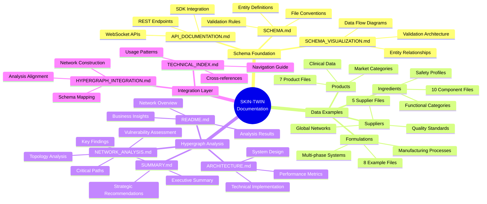
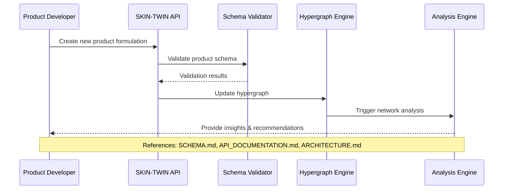
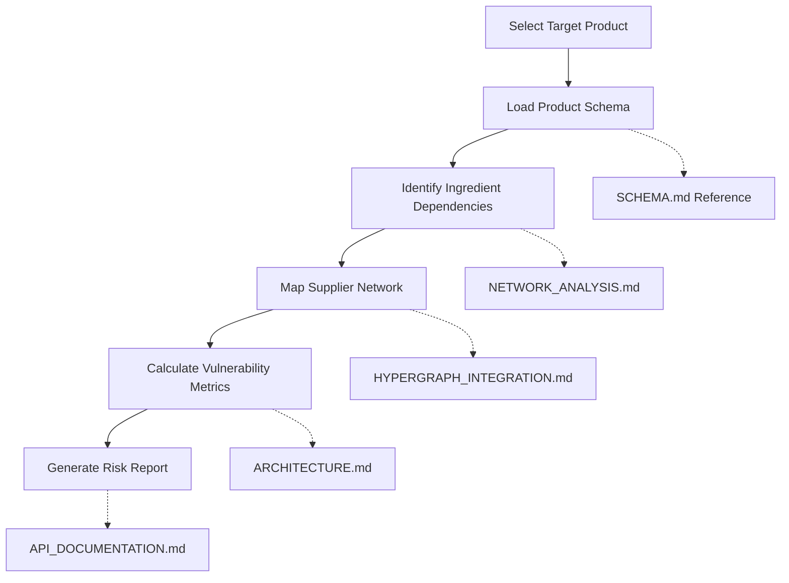
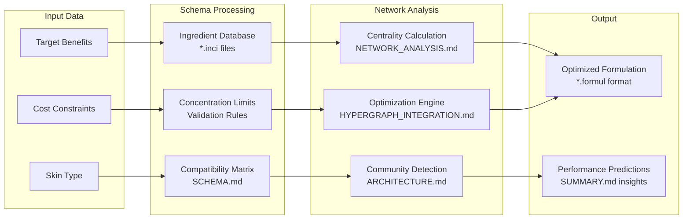

# SKIN-TWIN Technical Documentation Index

## Overview

This technical index provides comprehensive navigation through the SKIN-TWIN platform's documentation, data schemas, and analysis frameworks. All components are integrated with the hypergraph architecture for advanced network analysis.

## Documentation Architecture

### Core Documentation Structure



## Documentation Cross-Reference Matrix

### Schema → Analysis Mapping

| Schema Component | Analysis Documentation | Key Insights |
|------------------|----------------------|--------------|
| **Product Schema** | [README.md - Product Analysis](./examples/README.md#product-network-analysis) | Complexity scoring, market segmentation |
| **Ingredient Schema** | [NETWORK_ANALYSIS.md - Centrality](./examples/NETWORK_ANALYSIS.md#centrality-analysis) | Usage frequency, network importance |
| **Formulation Schema** | [ARCHITECTURE.md - Edge Processing](./examples/ARCHITECTURE.md#edge-processing) | Concentration validation, stability |
| **Supplier Schema** | [README.md - Supply Chain](./examples/README.md#supply-chain-analysis) | Geographic distribution, resilience |

### Implementation → Documentation Links

| Implementation File | Schema Reference | Visualization | API Endpoint |
|-------------------|------------------|---------------|--------------|
| `*.prod` files | [Product Schema](./SCHEMA.md#product-schema) | [Entity Diagram](./SCHEMA_VISUALIZATION.md#entity-relationship-architecture) | [Product API](./API_DOCUMENTATION.md#product-schema-operations) |
| `*.inci` files | [Ingredient Schema](./SCHEMA.md#ingredient-schema) | [Network Layer](./SCHEMA_VISUALIZATION.md#network-layer-architecture) | [Ingredient API](./API_DOCUMENTATION.md#ingredient-schema-operations) |
| `*.formul` files | [Formulation Schema](./SCHEMA.md#formulation-edge-schema) | [Data Flow](./SCHEMA_VISUALIZATION.md#data-flow-architecture) | [Formulation API](./API_DOCUMENTATION.md#formulation-operations) |
| `*.supp` files | [Supplier Schema](./SCHEMA.md#supplier-schema) | [Supply Network](./SCHEMA_VISUALIZATION.md#supply-chain-analysis) | [Supply Chain API](./API_DOCUMENTATION.md#supply-chain-analysis) |

## Usage Patterns & Examples

### 1. Product Development Workflow



**Documentation References:**
- Schema validation: [SCHEMA.md - Validation Rules](./SCHEMA.md#validation-rules)
- API integration: [API_DOCUMENTATION.md - Product Operations](./API_DOCUMENTATION.md#product-schema-operations)
- Network analysis: [ARCHITECTURE.md - Hypergraph Structure](./examples/ARCHITECTURE.md#hypergraph-structure)

### 2. Supply Chain Risk Assessment



**Implementation Example:**
```typescript
// Using documented API endpoints
const riskAssessment = await skinTwinAPI.supplyChain.assessVulnerability({
  productId: 'B19RDS001',
  analysisDepth: 'comprehensive'
});

// Reference: API_DOCUMENTATION.md - Supply Chain Analysis
```

### 3. Formulation Optimization



## File Organization & Navigation

### Directory Structure
```
vessels/
├── README.md                          # Main documentation entry point
├── SCHEMA.md                          # Core schema definitions
├── SCHEMA_VISUALIZATION.md            # Visual schema documentation
├── API_DOCUMENTATION.md               # Technical API reference
├── HYPERGRAPH_INTEGRATION.md          # Integration layer documentation
├── TECHNICAL_INDEX.md                 # This navigation document
├── examples/                          # Hypergraph analysis results
│   ├── README.md                      # Comprehensive network analysis
│   ├── ARCHITECTURE.md                # Technical implementation
│   ├── NETWORK_ANALYSIS.md            # Advanced topology analysis
│   ├── SUMMARY.md                     # Executive summary
│   └── *.csv                          # Network data files
├── formulations/                      # Example formulation data
│   ├── daily_ultra_def_spf25.formul   # SPF protection formulation
│   ├── hydrating_essence_serum.formul # Hydration treatment
│   ├── brightening_vitamin_c_complex.formul # Brightening serum
│   ├── gentle_cleansing_oil.formul    # Cleansing formulation
│   └── ...                           # Additional formulations
├── ingredients/                       # Ingredient database
│   ├── hyaluronic_acid.inci          # Hydrating humectant
│   ├── niacinamide.inci              # Multi-functional active
│   ├── ceramide_np.inci              # Barrier repair lipid
│   ├── salicylic_acid.inci           # Chemical exfoliant
│   ├── peptide_complex.inci          # Anti-aging active
│   └── ...                           # Additional ingredients
├── products/                          # Product examples
│   ├── vitamin_c_serum.prod          # Brightening serum
│   ├── barrier_recovery_night_cream.prod # Barrier repair
│   ├── purifying_bha_toner.prod      # Exfoliating toner
│   ├── intensive_eye_renewal_cream.prod # Eye treatment
│   └── ...                           # Additional products
└── suppliers/                         # Supplier network
    ├── basf_personal_care.supp       # Global chemical supplier
    ├── evonik_personal_care.supp     # Specialty ingredients
    ├── botanichem.supp               # Natural extracts
    └── ...                           # Additional suppliers
```

## Quick Reference Guide

### Common Use Cases

1. **New Formulation Development**
   - Start: [SCHEMA.md - Formulation Schema](./SCHEMA.md#formulation-edge-schema)
   - Validate: [API_DOCUMENTATION.md - Formulation API](./API_DOCUMENTATION.md#formulation-operations)
   - Analyze: [NETWORK_ANALYSIS.md - Network Metrics](./examples/NETWORK_ANALYSIS.md#network-metrics-deep-dive)

2. **Ingredient Research**
   - Schema: [SCHEMA.md - Ingredient Schema](./SCHEMA.md#ingredient-schema)
   - Examples: [ingredients/ directory](./ingredients/)
   - Analysis: [README.md - Ingredient Analysis](./examples/README.md#ingredient-usage-patterns)

3. **Supply Chain Analysis**
   - Schema: [SCHEMA.md - Supplier Schema](./SCHEMA.md#supplier-schema)
   - Integration: [HYPERGRAPH_INTEGRATION.md](./HYPERGRAPH_INTEGRATION.md)
   - Insights: [SUMMARY.md - Supply Chain](./examples/SUMMARY.md#supply-chain-insights)

4. **API Integration**
   - Documentation: [API_DOCUMENTATION.md](./API_DOCUMENTATION.md)
   - Authentication: [API_DOCUMENTATION.md - Authentication](./API_DOCUMENTATION.md#authentication)
   - Examples: [API_DOCUMENTATION.md - SDKs](./API_DOCUMENTATION.md#sdks-and-integration)

### Key Technical Concepts

| Concept | Primary Documentation | Supporting Files |
|---------|----------------------|------------------|
| **Hypergraph Architecture** | [ARCHITECTURE.md](./examples/ARCHITECTURE.md) | [SCHEMA_VISUALIZATION.md](./SCHEMA_VISUALIZATION.md) |
| **Network Centrality** | [NETWORK_ANALYSIS.md](./examples/NETWORK_ANALYSIS.md) | [README.md](./examples/README.md) |
| **Schema Validation** | [SCHEMA.md](./SCHEMA.md) | [API_DOCUMENTATION.md](./API_DOCUMENTATION.md) |
| **Supply Chain Resilience** | [README.md](./examples/README.md) | [SUMMARY.md](./examples/SUMMARY.md) |

## Development Workflows

### Schema Development Cycle
1. **Design** → Reference [SCHEMA.md](./SCHEMA.md) for patterns
2. **Validate** → Use [SCHEMA_VISUALIZATION.md](./SCHEMA_VISUALIZATION.md) diagrams
3. **Implement** → Follow [API_DOCUMENTATION.md](./API_DOCUMENTATION.md) specifications
4. **Test** → Validate against [examples/](./examples/) data
5. **Analyze** → Generate insights using [HYPERGRAPH_INTEGRATION.md](./HYPERGRAPH_INTEGRATION.md)

### Data Integration Workflow
1. **Prepare Data** → Follow [SCHEMA.md - File Conventions](./SCHEMA.md#file-naming-conventions)
2. **Validate Schema** → Use [API_DOCUMENTATION.md - Validation](./API_DOCUMENTATION.md#data-validation-api)
3. **Build Network** → Reference [ARCHITECTURE.md](./examples/ARCHITECTURE.md)
4. **Analyze Results** → Apply [NETWORK_ANALYSIS.md](./examples/NETWORK_ANALYSIS.md) methods

## Support & Resources

### Technical Support
- **Schema Questions**: Reference [SCHEMA.md](./SCHEMA.md) validation rules
- **API Issues**: Consult [API_DOCUMENTATION.md](./API_DOCUMENTATION.md) error handling
- **Analysis Interpretation**: Review [examples/](./examples/) documentation

### Best Practices
- **Data Quality**: Follow [SCHEMA.md - Validation Rules](./SCHEMA.md#validation-rules)
- **Performance**: Implement [SCHEMA_VISUALIZATION.md - Optimization](./SCHEMA_VISUALIZATION.md#performance-optimization-schema)
- **Integration**: Use [HYPERGRAPH_INTEGRATION.md](./HYPERGRAPH_INTEGRATION.md) patterns

This technical index provides comprehensive navigation through the SKIN-TWIN documentation ecosystem, enabling efficient development and analysis workflows.