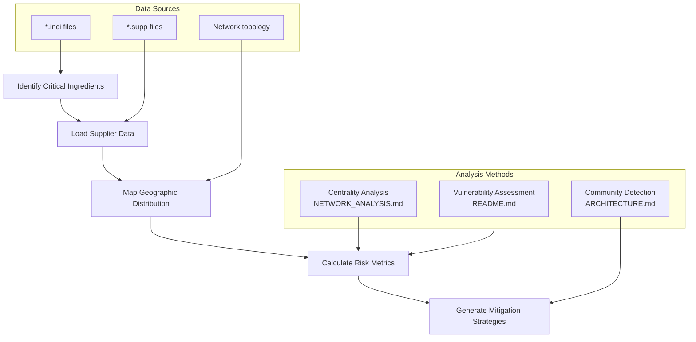

# SKIN-TWIN Usage Examples & Best Practices

## Overview

This document provides practical examples and best practices for using the SKIN-TWIN platform, demonstrating real-world applications of the schema system, hypergraph analysis, and API integration.

## Getting Started Examples

### 1. Basic Product Analysis

#### Scenario: Analyzing an existing product's network position

```typescript
// Step 1: Load product data using schema-compliant format
const productData = {
  "product_id": "B19HSR003",
  "product_name": "Hydrating Essence Serum", 
  "category": "Hydrating Treatment",
  "target_skin_type": ["Dehydrated", "Sensitive"],
  // ... full schema per SCHEMA.md
};

// Step 2: Validate against schema (API_DOCUMENTATION.md reference)
const validationResult = await skinTwinAPI.validation.schema({
  entity_type: "product",
  data: productData,
  validation_level: "comprehensive"
});

// Step 3: Analyze network position (NETWORK_ANALYSIS.md concepts)
const networkAnalysis = await skinTwinAPI.network.centrality({
  type: "betweenness",
  entity: "product",
  focus_id: "B19HSR003"
});

console.log(`Network centrality score: ${networkAnalysis.centrality_score}`);
console.log(`Connected ingredients: ${networkAnalysis.connected_nodes.length}`);
```

**Documentation References:**
- Schema structure: [SCHEMA.md - Product Schema](../SCHEMA.md#product-schema)
- API endpoints: [API_DOCUMENTATION.md - Product Operations](../API_DOCUMENTATION.md#product-schema-operations)
- Network concepts: [NETWORK_ANALYSIS.md - Centrality](../examples/NETWORK_ANALYSIS.md#centrality-analysis)

### 2. Ingredient Compatibility Analysis

#### Scenario: Checking ingredient compatibility before formulation

```typescript
// Step 1: Load ingredients from schema-compliant files
const ingredients = [
  await loadIngredient("niacinamide.inci"),      // Multi-functional active
  await loadIngredient("salicylic_acid.inci"),  // Chemical exfoliant  
  await loadIngredient("hyaluronic_acid.inci")  // Hydrating agent
];

// Step 2: Check compatibility matrix (SCHEMA.md reference)
const compatibilityCheck = ingredients.map(ing => ({
  ingredient: ing.inci_name,
  avoid_list: ing.compatibility.avoid || [],
  requires_care: ing.compatibility.requires_care || []
}));

// Step 3: Analyze potential conflicts
const conflicts = findIncompatibilities(compatibilityCheck);
if (conflicts.length > 0) {
  console.warn("Compatibility issues detected:", conflicts);
}

// Step 4: Get network-based recommendations
const recommendations = await skinTwinAPI.network.traverse({
  start_nodes: ingredients.map(i => i.id),
  traversal_rules: {
    max_depth: 2,
    edge_types: ["formulation", "compatibility"],
    return_format: "paths"
  }
});
```

**Key Learning Points:**
- Ingredient compatibility follows documented patterns in [SCHEMA.md](../SCHEMA.md#ingredient-schema)
- Network traversal reveals indirect relationships per [ARCHITECTURE.md](../examples/ARCHITECTURE.md#network-layers)
- API provides automated compatibility checking per [API_DOCUMENTATION.md](../API_DOCUMENTATION.md#cross-reference-validation)

## Advanced Use Cases

### 3. Supply Chain Risk Assessment

#### Scenario: Evaluating supply chain vulnerability for critical ingredients



```typescript
// Implementation example
async function assessSupplyChainRisk(productId: string) {
  // Step 1: Get product's ingredient dependencies
  const product = await skinTwinAPI.products.get(productId);
  const ingredients = product.formulation_edges.map(edge => edge.source_id);
  
  // Step 2: Analyze supplier network (per NETWORK_ANALYSIS.md)
  const supplyNetwork = await skinTwinAPI.supplyChain.network({
    depth: 3,
    focus: ingredients
  });
  
  // Step 3: Calculate vulnerability metrics
  const vulnerabilityReport = await skinTwinAPI.network.vulnerability();
  
  // Step 4: Generate risk assessment
  const riskAssessment = {
    critical_ingredients: vulnerabilityReport.critical_nodes.ingredients
      .filter(node => ingredients.includes(node.id)),
    single_point_failures: supplyNetwork.bottlenecks
      .filter(bottleneck => bottleneck.risk_level === "HIGH"),
    geographic_concentration: calculateGeographicRisk(supplyNetwork),
    mitigation_recommendations: generateMitigationStrategies(vulnerabilityReport)
  };
  
  return riskAssessment;
}
```

**Integration Points:**
- Follows vulnerability patterns from [README.md - Supply Chain Analysis](../examples/README.md#supply-chain-analysis)
- Uses network topology from [ARCHITECTURE.md](../examples/ARCHITECTURE.md#hypergraph-structure)
- Implements API patterns from [API_DOCUMENTATION.md - Supply Chain](../API_DOCUMENTATION.md#supply-chain-analysis)

### 4. Formulation Optimization

#### Scenario: Optimizing a formulation for cost and efficacy

```typescript
class FormulationOptimizer {
  constructor(private api: SkinTwinAPI) {}
  
  async optimizeFormulation(
    targetBenefits: string[],
    constraints: OptimizationConstraints
  ): Promise<OptimizedFormulation> {
    
    // Step 1: Find ingredients that deliver target benefits
    const candidateIngredients = await this.findIngredientsForBenefits(targetBenefits);
    
    // Step 2: Apply constraints (schema validation per SCHEMA.md)
    const filteredIngredients = candidateIngredients.filter(ingredient => 
      this.meetsConstraints(ingredient, constraints)
    );
    
    // Step 3: Use network analysis for optimization
    const networkOptimization = await this.api.network.optimize({
      objective: "multi-criteria",
      criteria: {
        efficacy: 0.4,
        cost: 0.3,
        safety: 0.2,
        stability: 0.1
      },
      ingredients: filteredIngredients
    });
    
    // Step 4: Generate optimized formulation
    return this.buildOptimizedFormulation(networkOptimization);
  }
  
  private async findIngredientsForBenefits(benefits: string[]) {
    // Search using documented schema patterns
    const searchResults = await this.api.search({
      q: benefits.join(" OR "),
      types: ["ingredient"],
      filters: {
        "functions": benefits,
        "safety_rating": ["GRAS", "COSMETICALLY_SAFE"]
      }
    });
    
    return searchResults.results;
  }
  
  private meetsConstraints(ingredient: any, constraints: OptimizationConstraints): boolean {
    // Validate against schema constraints per SCHEMA.md
    return (
      ingredient.pricing_zar <= constraints.max_cost_per_ingredient &&
      ingredient.concentration_range.max >= constraints.min_effective_concentration &&
      !constraints.excluded_categories.includes(ingredient.category)
    );
  }
}
```

**Best Practices Demonstrated:**
- Schema-driven development following [SCHEMA.md](../SCHEMA.md) patterns
- Network optimization using [ARCHITECTURE.md](../examples/ARCHITECTURE.md) concepts
- API integration per [API_DOCUMENTATION.md](../API_DOCUMENTATION.md) specifications

## Integration Patterns

### 5. Real-time Network Monitoring

#### Scenario: Monitoring network changes for impact assessment

```typescript
class NetworkMonitor {
  private websocket: WebSocket;
  
  constructor() {
    // Connect to real-time updates (API_DOCUMENTATION.md reference)
    this.websocket = new WebSocket('wss://api.skin-twin.com/ws/network-updates');
    this.setupEventHandlers();
  }
  
  private setupEventHandlers() {
    this.websocket.on('message', (event: NetworkUpdateEvent) => {
      switch (event.event_type) {
        case 'node_added':
          this.handleNewEntity(event);
          break;
        case 'edge_added':
          this.handleNewRelationship(event);
          break;
        case 'node_updated':
          this.handleEntityUpdate(event);
          break;
      }
    });
  }
  
  private async handleNewEntity(event: NetworkUpdateEvent) {
    // Assess impact using network analysis concepts from NETWORK_ANALYSIS.md
    const impactAssessment = await this.calculateNetworkImpact(event);
    
    if (impactAssessment.significance > 0.7) {
      // Trigger recalculation of key metrics
      await this.recalculateNetworkMetrics();
      
      // Notify stakeholders of significant changes
      this.notifyStakeholders({
        type: 'significant_network_change',
        entity: event.entity_id,
        impact: impactAssessment
      });
    }
  }
  
  private async calculateNetworkImpact(event: NetworkUpdateEvent) {
    // Use centrality analysis patterns from documentation
    const centralityChange = await this.api.network.centrality({
      type: 'all',
      focus_entity: event.entity_id
    });
    
    return {
      significance: centralityChange.impact_score,
      affected_nodes: centralityChange.influenced_nodes,
      network_stability: centralityChange.stability_metric
    };
  }
}
```

### 6. Batch Data Processing

#### Scenario: Processing multiple data files for network construction

```typescript
async function processBatchData(dataDirectory: string): Promise<ProcessingReport> {
  const processor = new BatchProcessor();
  
  // Step 1: Discover and categorize files
  const files = await processor.discoverFiles(dataDirectory);
  const categorizedFiles = processor.categorizeBySchema(files);
  
  // Step 2: Validate all schemas (SCHEMA.md compliance)
  const validationResults = await Promise.all([
    processor.validateFiles(categorizedFiles.products, 'product'),
    processor.validateFiles(categorizedFiles.ingredients, 'ingredient'),
    processor.validateFiles(categorizedFiles.formulations, 'formulation'),
    processor.validateFiles(categorizedFiles.suppliers, 'supplier')
  ]);
  
  // Step 3: Build hypergraph incrementally
  const graphBuilder = new HypergraphBuilder();
  
  for (const productFile of categorizedFiles.products) {
    const product = await processor.loadAndValidate(productFile);
    graphBuilder.addNode(product, 'product');
  }
  
  for (const ingredientFile of categorizedFiles.ingredients) {
    const ingredient = await processor.loadAndValidate(ingredientFile);
    graphBuilder.addNode(ingredient, 'ingredient');
  }
  
  // Step 4: Add relationships
  for (const formulationFile of categorizedFiles.formulations) {
    const formulation = await processor.loadAndValidate(formulationFile);
    graphBuilder.addEdges(formulation.manufacturing_sequence, 'formulation');
  }
  
  // Step 5: Generate analysis report
  const network = graphBuilder.build();
  const analysisReport = await generateComprehensiveAnalysis(network);
  
  return {
    files_processed: files.length,
    validation_results: validationResults,
    network_metrics: analysisReport.metrics,
    insights: analysisReport.insights
  };
}
```

## Performance Optimization Examples

### 7. Efficient Query Patterns

```typescript
// Optimized query patterns based on SCHEMA_VISUALIZATION.md performance guidelines

class OptimizedQueryManager {
  private cache = new Map<string, any>();
  
  // Pattern 1: Batch related queries
  async getProductWithDependencies(productId: string) {
    const cacheKey = `product_full_${productId}`;
    
    if (this.cache.has(cacheKey)) {
      return this.cache.get(cacheKey);
    }
    
    // Single API call for all related data
    const fullProduct = await this.api.products.getWithRelations(productId, {
      include: ['ingredients', 'suppliers', 'formulation_edges'],
      depth: 2
    });
    
    this.cache.set(cacheKey, fullProduct);
    return fullProduct;
  }
  
  // Pattern 2: Incremental network updates
  async updateNetworkIncremental(changes: NetworkChange[]) {
    // Process changes in batches to minimize recalculation
    const batchedChanges = this.batchChangesByImpact(changes);
    
    for (const batch of batchedChanges) {
      await this.api.network.updateIncremental({
        changes: batch,
        recalculate_metrics: batch.some(c => c.impact_level === 'high')
      });
    }
  }
  
  // Pattern 3: Selective metric calculation
  async calculateMetricsSelective(scope: AnalysisScope) {
    // Only calculate metrics needed for specific use case
    const metrics = await this.api.network.calculateMetrics({
      scope: scope.entity_types,
      metrics: scope.required_metrics,
      approximation_level: scope.precision_requirement
    });
    
    return metrics;
  }
}
```

## Error Handling & Validation

### 8. Robust Error Handling

```typescript
class RobustDataProcessor {
  async processWithRetry<T>(
    operation: () => Promise<T>,
    maxRetries: number = 3
  ): Promise<T> {
    let lastError: Error;
    
    for (let attempt = 1; attempt <= maxRetries; attempt++) {
      try {
        return await operation();
      } catch (error) {
        lastError = error as Error;
        
        // Handle specific API errors per API_DOCUMENTATION.md
        if (this.isRetryableError(error)) {
          const delay = Math.pow(2, attempt) * 1000; // Exponential backoff
          await this.sleep(delay);
          continue;
        }
        
        // Non-retryable errors
        throw error;
      }
    }
    
    throw new Error(`Operation failed after ${maxRetries} attempts: ${lastError.message}`);
  }
  
  private isRetryableError(error: any): boolean {
    const retryableCodes = [
      'RATE_LIMIT_EXCEEDED',
      'NETWORK_COMPUTATION_ERROR',
      'INTERNAL_SERVER_ERROR'
    ];
    
    return retryableCodes.includes(error.code);
  }
  
  async validateDataIntegrity(data: any): Promise<ValidationReport> {
    // Comprehensive validation following SCHEMA.md patterns
    const validationSteps = [
      () => this.validateSchemaCompliance(data),
      () => this.validateReferentialIntegrity(data),
      () => this.validateBusinessLogic(data),
      () => this.validateNetworkConsistency(data)
    ];
    
    const results = await Promise.allSettled(validationSteps.map(step => step()));
    
    return this.compileValidationReport(results);
  }
}
```

## Testing & Quality Assurance

### 9. Schema Validation Testing

```typescript
describe('Schema Validation', () => {
  // Test patterns based on SCHEMA.md validation rules
  
  test('Product schema validation', async () => {
    const validProduct = {
      id: 'B19TEST001',
      label: 'Test Product',
      category: 'Test Category',
      ingredient_count: 5,
      complexity_score: 25,
      // ... complete schema
    };
    
    const result = await skinTwinAPI.validation.schema({
      entity_type: 'product',
      data: validProduct
    });
    
    expect(result.is_valid).toBe(true);
    expect(result.compliance_score).toBeGreaterThan(0.9);
  });
  
  test('Cross-reference validation', async () => {
    // Test referential integrity per SCHEMA.md requirements
    const formulationEdge = {
      source_id: 'R123456', // Must exist in ingredients
      target_id: 'B19TEST001', // Must exist in products
      concentration: 5.0
    };
    
    const result = await skinTwinAPI.validation.crossReference({
      primary_entity: { type: 'formulation', id: 'edge_001' },
      referenced_entities: [
        { type: 'ingredient', id: formulationEdge.source_id },
        { type: 'product', id: formulationEdge.target_id }
      ]
    });
    
    expect(result.referential_integrity).toBe(true);
  });
});
```

## Production Deployment

### 10. Deployment Best Practices

```typescript
// Production configuration following API_DOCUMENTATION.md guidelines

const productionConfig = {
  api: {
    baseUrl: process.env.SKIN_TWIN_API_URL,
    apiKey: process.env.SKIN_TWIN_API_KEY,
    timeout: 30000,
    retries: 3
  },
  cache: {
    ttl: 300000, // 5 minutes
    maxSize: 1000
  },
  monitoring: {
    errorReporting: true,
    performanceMetrics: true,
    networkAnalysis: {
      batchSize: 100,
      maxConcurrency: 5
    }
  }
};

class ProductionSkinTwinClient {
  constructor(private config: ProductionConfig) {
    this.setupMonitoring();
    this.configureErrorHandling();
  }
  
  private setupMonitoring() {
    // Monitor API performance and network health
    this.performanceMonitor = new PerformanceMonitor({
      endpoint: this.config.monitoring.endpoint,
      metrics: ['response_time', 'error_rate', 'throughput']
    });
  }
  
  private configureErrorHandling() {
    // Implement robust error handling per documentation
    process.on('unhandledRejection', (error) => {
      console.error('Unhandled promise rejection:', error);
      this.errorReporter.report(error);
    });
  }
}
```

## Summary

These usage examples demonstrate:

1. **Schema-driven development** following [SCHEMA.md](../SCHEMA.md) patterns
2. **Network analysis integration** using [ARCHITECTURE.md](../examples/ARCHITECTURE.md) concepts  
3. **API best practices** per [API_DOCUMENTATION.md](../API_DOCUMENTATION.md) specifications
4. **Performance optimization** guided by [SCHEMA_VISUALIZATION.md](../SCHEMA_VISUALIZATION.md) recommendations
5. **Real-world application** of [hypergraph analysis](../examples/) insights

Each example includes cross-references to the comprehensive documentation ecosystem, enabling developers to build robust applications on the SKIN-TWIN platform.