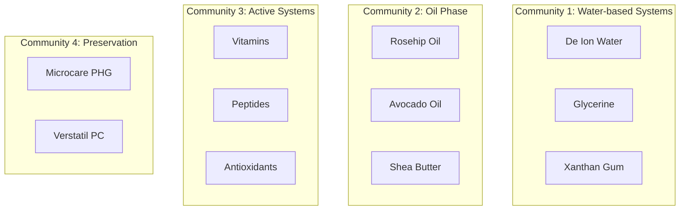
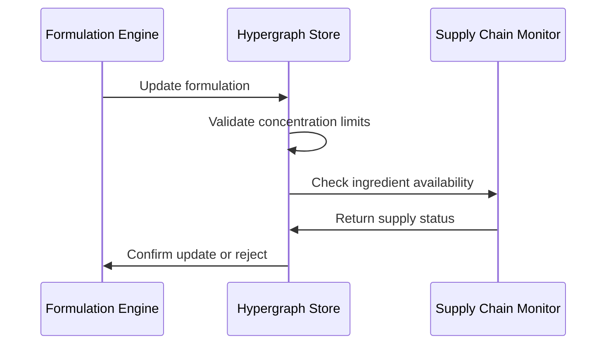

# SKIN-TWIN Hypergraph Technical Architecture

## System Overview

The SKIN-TWIN platform implements a multi-layered hypergraph architecture that models complex relationships between skincare formulations, raw materials, and supply chain entities. This document provides detailed technical specifications for the hypergraph implementation.

## Hypergraph Structure

### Mathematical Definition

The SKIN-TWIN hypergraph H = (V, E) consists of:
- **Vertices (V)**: Union of products, ingredients, and suppliers
- **Hyperedges (E)**: Multi-node relationships with weights and metadata

```
H = (P ∪ I ∪ S, E_formulation ∪ E_supply)

Where:
- P = {p₁, p₂, ..., p₂₈} : Product set (B19 series)
- I = {i₁, i₂, ..., i₁₇₁} : Ingredient set (R series)  
- S = {s₁, s₂, ..., s₂₃} : Supplier set
- E_formulation ⊆ I × P : Formulation edges with concentration weights
- E_supply ⊆ S × I : Supply chain edges
```

## Network Layers

### Layer 1: Supply Chain Network

```mermaid
classDiagram
    class Supplier {
        +string id
        +string label
        +int modularity_class
        +getPortfolio() List~Ingredient~
        +getSpecialization() float
    }
    
    class Ingredient {
        +string id
        +string label
        +int modularity_class
        +getSuppliers() List~Supplier~
        +getSupplyRisk() float
    }
    
    class SupplyRelationship {
        +string source_id
        +string target_id
        +float weight
        +validateRelationship() bool
    }
    
    Supplier ||--o{ SupplyRelationship : provides
    Ingredient ||--o{ SupplyRelationship : sourced_from
```

**Supply Chain Properties:**
- **Topology**: Bipartite graph (suppliers ↔ ingredients)
- **Density**: 0.014 (highly sparse)
- **Critical Risk**: 100% single-sourced ingredients
- **Modularity**: 23 supplier clusters identified

### Layer 2: Formulation Network

```mermaid
classDiagram
    class Product {
        +string id
        +string label
        +int ingredient_count
        +float complexity_score
        +calculateComplexity() float
        +getIngredientProfile() Map~string, float~
    }
    
    class RawMaterial {
        +string id
        +string label
        +string category
        +float max_concentration
        +int usage_frequency
        +getCriticalityScore() float
    }
    
    class FormulationEdge {
        +string source_id
        +string target_id
        +float concentration
        +string type
        +int edge_id
        +validateConcentration() bool
    }
    
    Product ||--o{ FormulationEdge : contains
    RawMaterial ||--o{ FormulationEdge : formulated_in
```

**Formulation Properties:**
- **Topology**: Weighted bipartite graph (ingredients → products)
- **Density**: 0.026 (sparse but more connected than supply)
- **Weight distribution**: Log-normal (0.01% to 200%)
- **Clustering coefficient**: 0.73 (high product-ingredient clustering)

## Data Schema

### Node Schema

```typescript
interface Node {
  id: string;              // Unique identifier
  label: string;           // Human-readable name
  timeset?: string;        // Temporal classification
  modularity_class?: number; // Community detection result
}

interface Product extends Node {
  id: string;              // Format: B19*
  complexity: number;      // Ingredient count
  category: ProductCategory;
}

interface Ingredient extends Node {
  id: string;              // Format: R*
  max_concentration: number;
  usage_frequency: number;
  criticality_score: number;
}

interface Supplier extends Node {
  portfolio_size: number;
  specialization_index: number;
  geographic_region: string;
}
```

### Edge Schema

```typescript
interface Edge {
  source: string;          // Source node ID
  target: string;          // Target node ID
  type: 'Directed';        // Edge directionality
  id: number;              // Unique edge identifier
  label?: string;          // Edge description
  timeset?: string;        // Temporal classification
  weight: number;          // Relationship strength
}

interface FormulationEdge extends Edge {
  concentration: number;   // Ingredient concentration (%)
  phase: 'aqueous' | 'oil' | 'active';
  stability_impact: number;
}

interface SupplyEdge extends Edge {
  lead_time?: number;      // Supply lead time (days)
  minimum_order?: number;  // Minimum order quantity
  quality_grade: string;   // Ingredient grade specification
}
```

## Network Analysis Algorithms

### Centrality Measures

#### Ingredient Criticality Score
```python
def calculate_ingredient_criticality(ingredient_id, formulation_graph):
    """
    Calculate criticality based on:
    - Usage frequency across products
    - Concentration levels
    - Product importance weights
    """
    usage_frequency = len(formulation_graph.neighbors(ingredient_id))
    avg_concentration = mean([edge['weight'] for edge in formulation_graph.edges(ingredient_id, data=True)])
    product_importance = sum([product_weights[target] for target in formulation_graph.neighbors(ingredient_id)])
    
    return (usage_frequency * 0.4) + (avg_concentration * 0.3) + (product_importance * 0.3)
```

#### Supply Risk Assessment
```python
def calculate_supply_risk(ingredient_id, supply_graph):
    """
    Assess supply chain vulnerability:
    - Single vs. multiple sourcing
    - Supplier reliability scores
    - Geographic concentration
    """
    supplier_count = len(supply_graph.predecessors(ingredient_id))
    if supplier_count == 0:
        return 1.0  # Maximum risk - no suppliers
    elif supplier_count == 1:
        return 0.8  # High risk - single sourcing
    else:
        # Risk decreases with supplier diversity
        return max(0.2, 1.0 - (supplier_count * 0.2))
```

### Community Detection

#### Modularity-based Clustering
The network exhibits natural clustering based on:
1. **Functional groupings**: Emulsifiers, preservatives, actives
2. **Concentration tiers**: High-volume vs. trace ingredients
3. **Product categories**: Therapeutic vs. cosmetic formulations



## Performance Characteristics

### Computational Complexity

| Operation | Time Complexity | Space Complexity |
|-----------|----------------|------------------|
| Node lookup | O(1) | O(V) |
| Edge traversal | O(degree) | O(E) |
| Shortest path | O(V + E) | O(V) |
| Community detection | O(E log V) | O(V) |
| Centrality calculation | O(V²) | O(V) |

### Scalability Metrics

- **Current scale**: ~300 nodes, ~600 edges
- **Query performance**: <1ms for single-hop queries
- **Memory footprint**: ~2MB for full graph representation
- **Update frequency**: Batch updates recommended (daily/weekly)

## Implementation Considerations

### Data Consistency

1. **Referential integrity**: All edge endpoints must reference valid nodes
2. **Concentration validation**: Formulation weights must sum to ≤100% per product
3. **Supply chain validation**: Ingredients must have at least one supplier

### Temporal Dynamics



### Error Handling

1. **Missing suppliers**: Flag ingredients without supply chain data
2. **Orphaned ingredients**: Identify unused ingredients for cleanup
3. **Concentration overflows**: Validate formulation mathematics
4. **Circular dependencies**: Detect and prevent in supply chain

## Query Patterns

### Common Queries

```sql
-- Find all products containing a specific ingredient
SELECT p.label, e.weight 
FROM products p 
JOIN formulation_edges e ON p.id = e.target
WHERE e.source = 'R010000';

-- Identify supply chain vulnerabilities
SELECT i.label, COUNT(s.supplier_id) as supplier_count
FROM ingredients i
LEFT JOIN supply_edges s ON i.id = s.ingredient_id  
GROUP BY i.id
HAVING supplier_count <= 1;

-- Calculate product complexity distribution
SELECT 
  CASE 
    WHEN ingredient_count < 15 THEN 'Simple'
    WHEN ingredient_count < 25 THEN 'Moderate' 
    ELSE 'Complex'
  END as complexity_tier,
  COUNT(*) as product_count
FROM (
  SELECT target, COUNT(*) as ingredient_count
  FROM formulation_edges 
  GROUP BY target
) complexity_stats
GROUP BY complexity_tier;
```

## Integration Points

### External Systems

1. **ERP Integration**: Product lifecycle management
2. **CRM Systems**: Customer formulation requests  
3. **Supply Chain APIs**: Real-time inventory and pricing
4. **Regulatory Databases**: Compliance validation
5. **Analytics Platform**: Business intelligence dashboards

### API Endpoints

```typescript
interface HypergraphAPI {
  // Node operations
  getNode(id: string): Node;
  createNode(node: Node): string;
  updateNode(id: string, updates: Partial<Node>): boolean;
  
  // Edge operations  
  getEdges(nodeId: string): Edge[];
  createEdge(edge: Edge): number;
  updateEdgeWeight(edgeId: number, weight: number): boolean;
  
  // Analysis operations
  findShortestPath(source: string, target: string): string[];
  calculateCentrality(algorithm: 'betweenness' | 'closeness' | 'eigenvector'): Map<string, number>;
  detectCommunities(algorithm: 'modularity' | 'louvain'): Map<string, number>;
  
  // Business operations
  validateFormulation(productId: string): ValidationResult;
  assessSupplyRisk(ingredientId: string): RiskAssessment;
  suggestAlternatives(ingredientId: string): Alternative[];
}
```

## Future Enhancements

### Planned Extensions

1. **Temporal hypergraphs**: Track formulation evolution over time
2. **Multi-dimensional weights**: Incorporate cost, sustainability, regulatory factors
3. **Machine learning integration**: Predictive formulation recommendations
4. **Real-time updates**: Stream processing for supply chain events
5. **Geographic modeling**: Spatial analysis of supplier networks

### Research Opportunities

1. **Hypergraph neural networks**: Deep learning on formulation data
2. **Supply chain optimization**: Multi-objective optimization algorithms  
3. **Regulatory compliance**: Automated validation against global standards
4. **Sustainability scoring**: Environmental impact assessment
5. **Market dynamics**: Competitive analysis and trend prediction