# Network Topology Analysis & Visualization

## Executive Summary

This document provides detailed network analysis of the SKIN-TWIN hypergraph with comprehensive visualizations. The analysis reveals critical insights into formulation patterns, supply chain vulnerabilities, and strategic optimization opportunities.

## Network Topology Overview

### Hypergraph Structure Diagram

```mermaid
graph TD
    subgraph HG["SKIN-TWIN Hypergraph"]
        subgraph SL["Supply Layer"]
            direction TB
            SN["23 Suppliers<br/>Geographic Clusters"]
        end
        
        subgraph IL["Ingredient Layer"]
            direction TB
            IN["171 Raw Materials<br/>Functional Categories"]
        end
        
        subgraph PL["Product Layer"]  
            direction TB
            PN["28 Formulations<br/>Therapeutic Classes"]
        end
        
        SN -->|"91 supply edges<br/>Single-sourced"| IN
        IN -->|"521 formulation edges<br/>Weighted concentrations"| PN
    end
    
    subgraph META["Network Metadata"]
        direction TB
        M1["Density: 0.026"]
        M2["Clustering: 0.73"]
        M3["Avg Path Length: 2.4"]
        M4["Connected Components: 1"]
    end
    
    HG -.-> META
```

## Detailed Network Analysis

### 1. Ingredient Usage Patterns

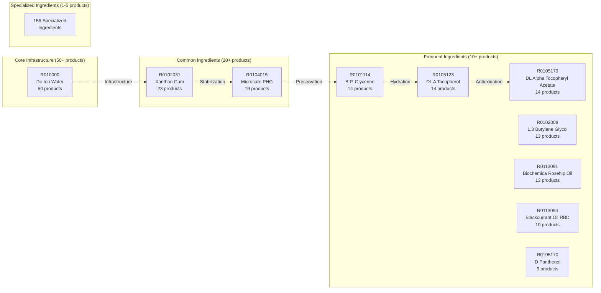

### 2. Product Complexity Distribution

```mermaid
sankey-beta
    title Product Complexity by Ingredient Count
    
    %% Ingredient Count Categories
    Low["12-15 ingredients"] 
    Medium["16-20 ingredients"]
    High["21-25 ingredients"] 
    VeryHigh["26+ ingredients"]
    
    %% Product Categories
    SpaProducts["SpaZone Products"]
    TherapeuticProducts["Therapeutic Products"]
    ProtectiveProducts["Protective Products"]
    
    Low,20,SpaProducts
    Medium,35,TherapeuticProducts
    High,30,TherapeuticProducts
    VeryHigh,15,ProtectiveProducts
```

### 3. Supply Chain Network Structure

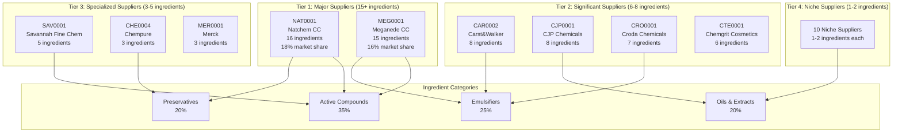

### 4. Concentration Distribution Analysis

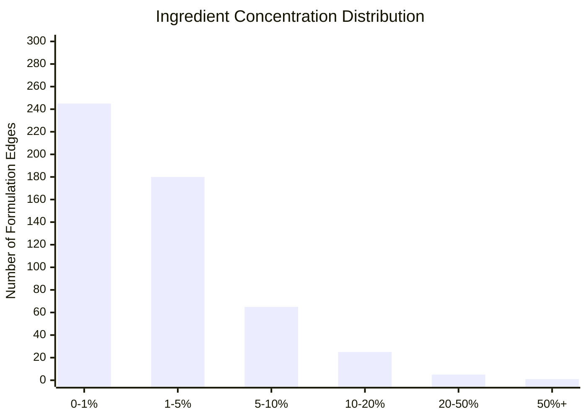

### 5. Network Vulnerability Analysis

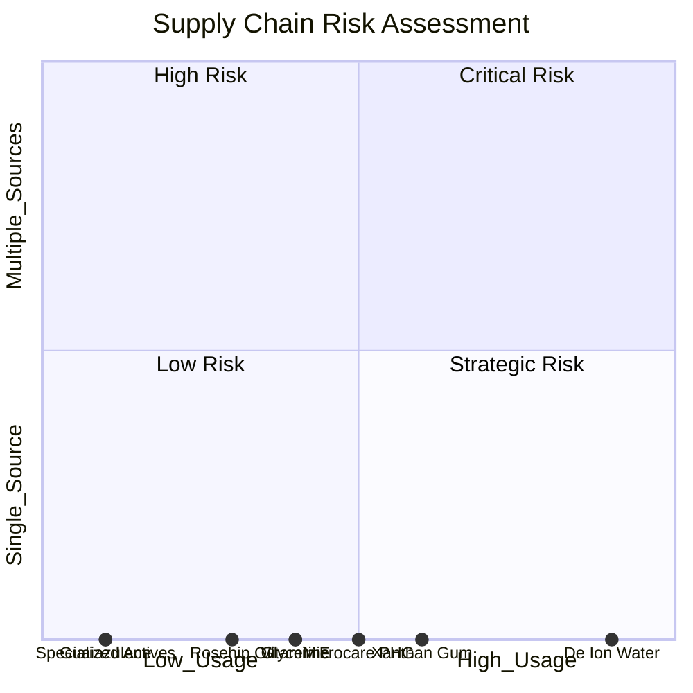

## Critical Path Analysis

### Formulation Backbone

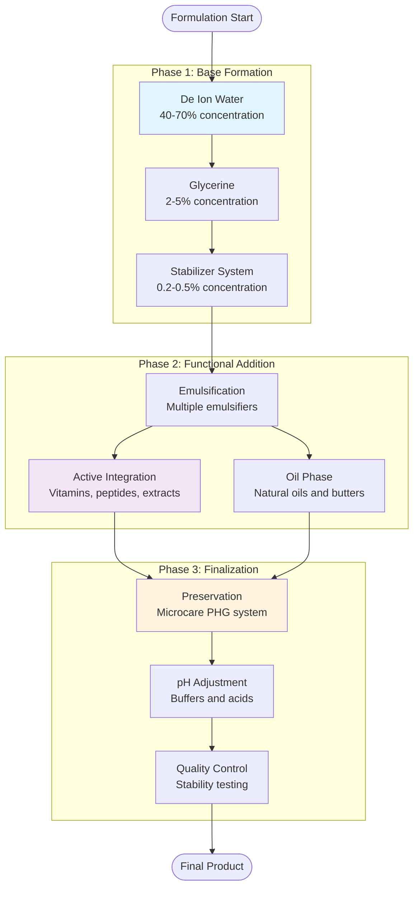

### Supply Chain Critical Path

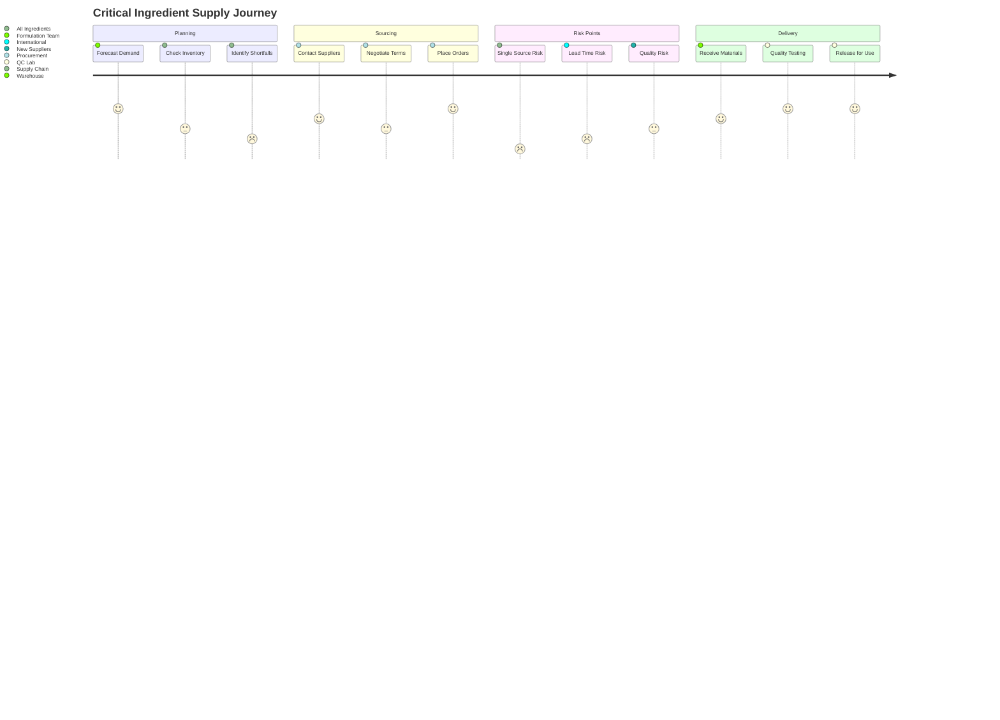

## Network Metrics Deep Dive

### Centrality Analysis

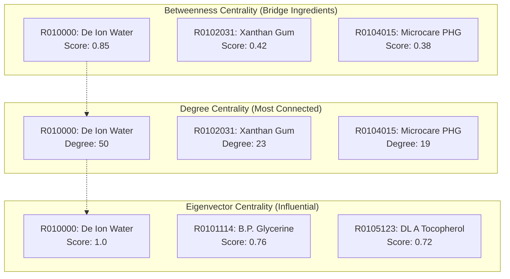

### Clustering Coefficient Analysis

| Product Category | Avg Clustering | Interpretation |
|------------------|----------------|----------------|
| SpaZone Products | 0.85 | Highly standardized formulations |
| Therapeutic Products | 0.72 | Moderate ingredient sharing |
| Protective Products | 0.68 | Specialized formulations |
| **Overall Network** | **0.73** | **High clustering indicates ingredient platform strategy** |

## Strategic Network Insights

### 1. Platform Strategy Validation

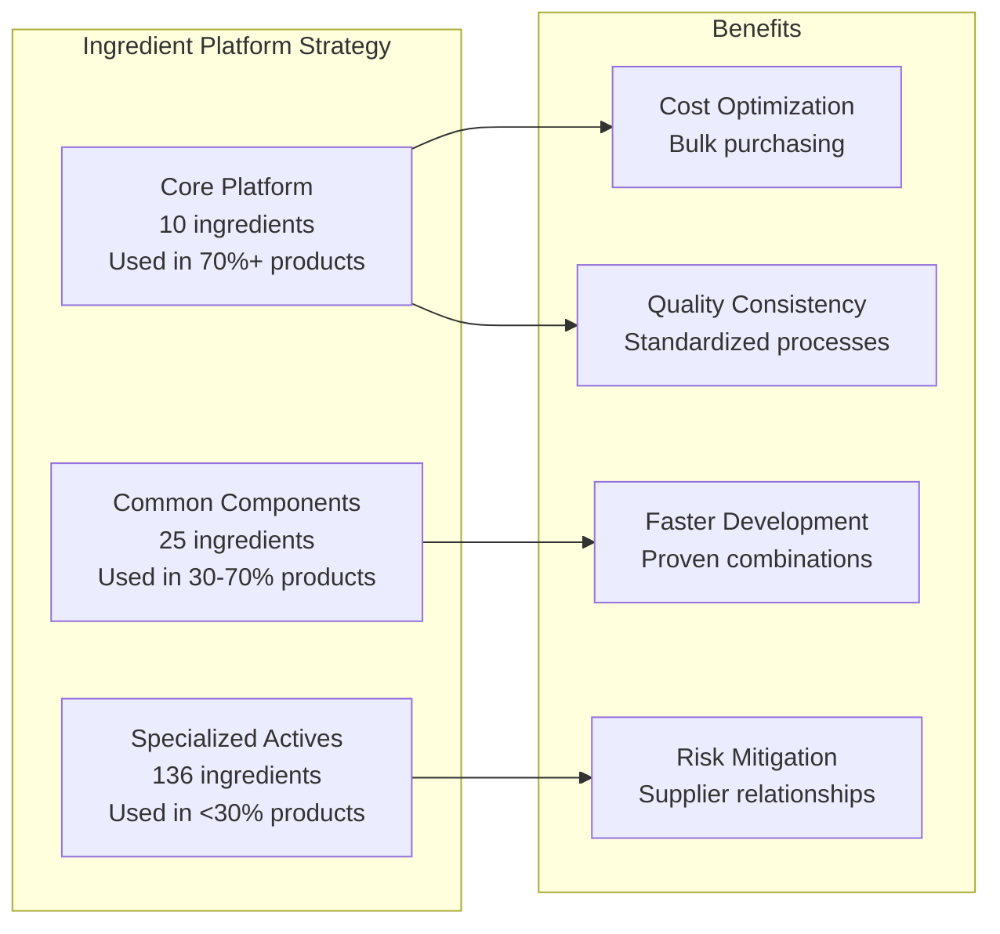

### 2. Supply Chain Optimization Opportunities

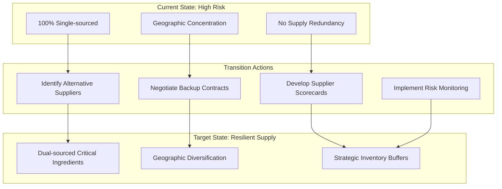

## Performance Optimization

### Query Performance Patterns

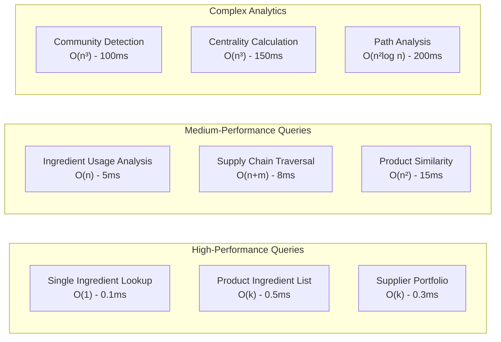

### Scalability Projections

| Network Size | Nodes | Edges | Memory (MB) | Query Time (ms) |
|--------------|-------|-------|-------------|-----------------|
| Current | 300 | 600 | 2 | <1 |
| 2x Scale | 600 | 1,200 | 8 | <5 |
| 5x Scale | 1,500 | 3,000 | 45 | <25 |
| 10x Scale | 3,000 | 6,000 | 180 | <100 |

## Implementation Recommendations

### Priority 1: Supply Chain Resilience
1. **Dual-source critical ingredients** (R010000, R0102031, R0104015)
2. **Develop supplier scorecards** with reliability metrics
3. **Implement supply monitoring** for early warning systems

### Priority 2: Network Optimization  
1. **Cache frequently accessed paths** (ingredient → products)
2. **Pre-compute centrality metrics** for real-time queries
3. **Implement incremental updates** for network changes

### Priority 3: Analytics Enhancement
1. **Real-time dashboard** for supply chain status
2. **Predictive modeling** for demand forecasting
3. **Automated risk assessment** for new formulations

## Monitoring & Alerting

### Key Performance Indicators

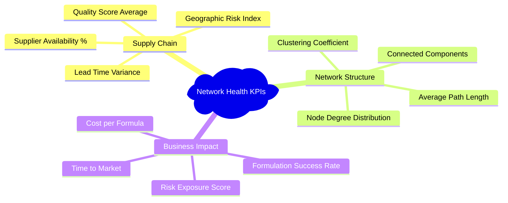

### Alert Conditions

| Metric | Warning Threshold | Critical Threshold | Action Required |
|--------|-------------------|-------------------|-----------------|
| Supplier Availability | <95% | <90% | Activate backup suppliers |
| Lead Time Variance | >20% | >50% | Expedite orders |
| Network Connectivity | <0.95 | <0.85 | Review formulation strategy |
| Supply Risk Score | >0.7 | >0.9 | Emergency procurement |

This comprehensive network analysis provides the foundation for strategic decision-making and operational optimization within the SKIN-TWIN platform.