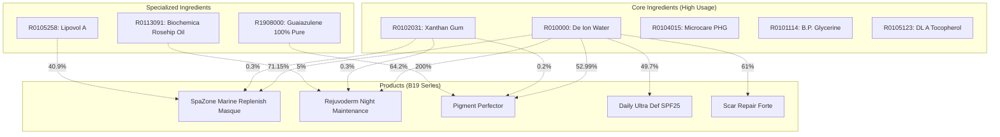
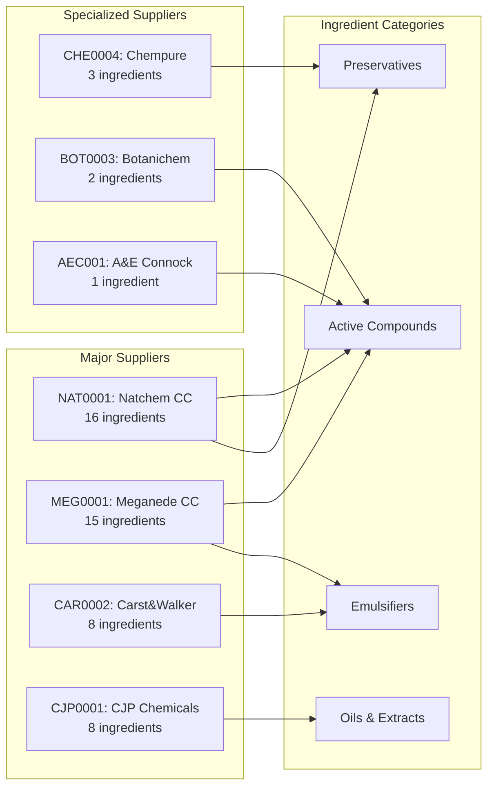
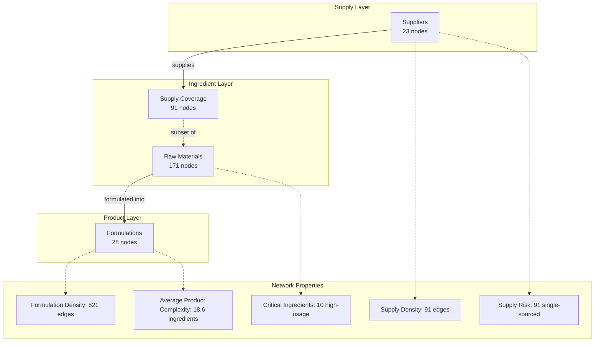

# SKIN-TWIN Hypergraph Analysis: Formulation & Supply Chain Networks

## Overview

This directory contains a comprehensive analysis of the SKIN-TWIN platform's hypergraph architecture, representing the interconnected relationships between skincare products, raw materials/ingredients, and suppliers. The hypergraph consists of two primary networks:

1. **Formulation Network (RAW data)**: Product formulation relationships
2. **Supply Chain Network (RS data)**: Supplier-ingredient relationships

## Data Structure

### Files
- `RAW-Nodes.csv`: 199 nodes (28 products + 171 ingredients)
- `RAW-Edges.csv`: 521 formulation relationships with concentration weights
- `RSNodes.csv`: 114 nodes (23 suppliers + 91 ingredients)
- `RSEdges.csv`: 91 supply chain relationships

### Node Categories

#### Products (B19 Series)
- 28 skincare formulations including masques, serums, oils, and protective products
- Product complexity ranges from 12-29 ingredients per formulation
- Examples: SpaZone Marine Replenish Masque, Rejuvoderm Night Maintenance, Pigment Perfector

#### Ingredients (R Series)  
- 171 unique raw materials and active ingredients
- Concentration ranges from 0.01% to 200% (pure ingredients)
- Categories include: emulsifiers, preservatives, active compounds, oils, extracts

#### Suppliers
- 23 specialized chemical and cosmetic ingredient suppliers
- Portfolio sizes range from 1-16 ingredients per supplier
- Geographic focus: South African supplier network

## Network Architecture

### Formulation Network Topology

### Supply Chain Network Architecture

### Combined Hypergraph Architecture

## Key Insights

### Formulation Network Analysis

#### Most Complex Products (High Ingredient Count)
1. **Scar Repair Forte** (29 ingredients) - Advanced therapeutic formulation
2. **Daily Ultra Def SPF25** (26 ingredients) - Multi-functional sun protection
3. **Pigment Perfector** (25 ingredients) - Specialized pigmentation treatment
4. **Rejuvoderm Night Maintenance** (24 ingredients) - Comprehensive night repair
5. **Omega Night Complex** (24 ingredients) - Essential fatty acid complex

#### Critical Infrastructure Ingredients
- **De Ion Water (R010000)**: Used in 50 products (89% of portfolio)
- **Xanthan Gum (R0102031)**: Used in 23 products (stabilizer/thickener)
- **Microcare PHG (R0104015)**: Used in 19 products (preservative system)

#### High-Concentration Ingredients
- **Guaiazulene 100% Pure**: 200% concentration (pure ingredient)
- **De Ion Water**: Up to 71.15% (primary base)
- **Lipovol A (Avocado oil)**: Up to 40.9% (active oil phase)

### Supply Chain Network Analysis

#### Supply Chain Concentration
- **Top 4 suppliers** control 44% of ingredient supply (39/91 ingredients)
- **Natchem CC**: Largest portfolio (16 ingredients, 18% market share)
- **Meganede CC**: Second largest (15 ingredients, 16% market share)

#### Supply Chain Risks
- **100% single-sourced ingredients**: All 91 ingredients have only one supplier
- **Critical dependencies**: No supply redundancy for any ingredient
- **Geographic concentration**: Primarily South African supplier base

#### Supplier Specialization Patterns
- **Diversified suppliers**: NAT0001, MEG0001 (15-16 ingredients each)
- **Specialized suppliers**: 8 suppliers with 1-3 ingredients each
- **Active compound specialists**: BOT0003, MEG0001 focus on bioactive ingredients

## Network Topology Metrics

### Formulation Network (RAW)
- **Nodes**: 199 (28 products, 171 ingredients)
- **Edges**: 521 weighted relationships
- **Average degree**: 5.2 connections per node
- **Network density**: 0.026 (sparse network)
- **Clustering**: High product-ingredient clustering

### Supply Chain Network (RS)
- **Nodes**: 114 (23 suppliers, 91 ingredients)  
- **Edges**: 91 supply relationships
- **Average degree**: 1.6 connections per node
- **Network density**: 0.014 (very sparse)
- **Structure**: Bipartite supplier-ingredient graph

### Hypergraph Properties
- **Layers**: 3 (suppliers → ingredients → products)
- **Cross-layer connectivity**: 53% ingredient overlap between networks
- **Critical paths**: Water → stabilizers → preservatives form backbone
- **Vulnerability points**: Single-supplier dependencies throughout

## Strategic Implications

### Formulation Strategy
1. **Ingredient standardization**: Core ingredients (water, glycerine, preservatives) provide platform efficiency
2. **Complexity management**: Product complexity correlates with therapeutic claims
3. **Innovation opportunities**: Specialized ingredients differentiate premium products

### Supply Chain Strategy  
1. **Risk mitigation**: Urgent need for supplier diversification
2. **Strategic partnerships**: Develop preferred supplier relationships
3. **Vertical integration**: Consider in-house production for critical ingredients
4. **Geographic expansion**: Develop international supplier networks

## Future Analysis Opportunities

1. **Dynamic analysis**: Track formulation changes over time
2. **Cost modeling**: Integrate ingredient pricing data
3. **Regulatory mapping**: Add regulatory compliance requirements
4. **Market analysis**: Correlate with product performance metrics
5. **Sustainability assessment**: Environmental impact of ingredient sourcing

---

*This analysis represents the hypergraph structure as of the current dataset snapshot. Regular updates recommended as formulations and supplier relationships evolve.*
